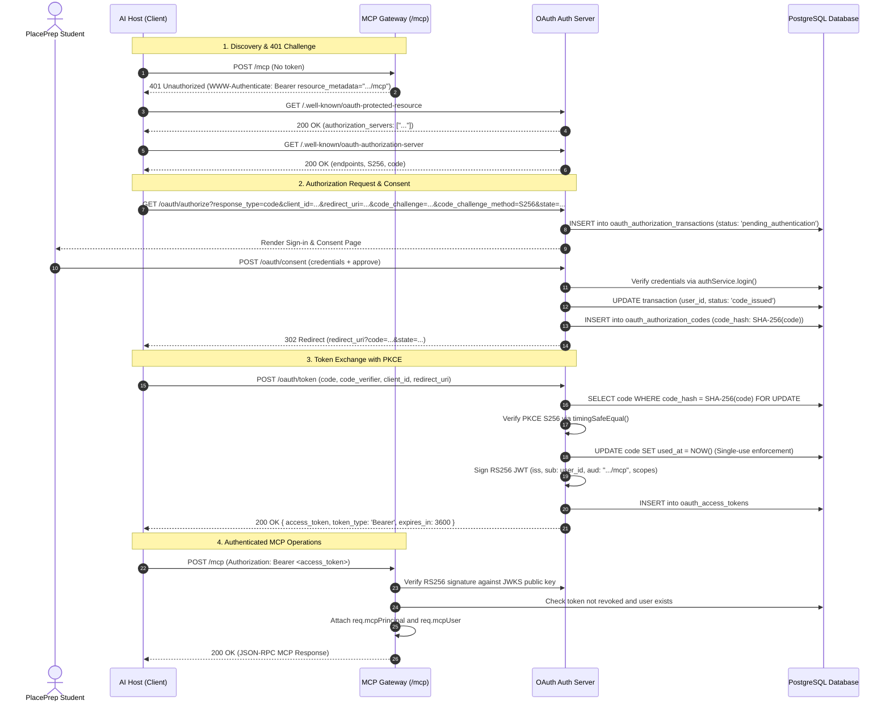

# PlacePrep OAuth 2.1 / PKCE Architecture & Specification

## 1. Executive Summary & Design Principles

PlacePrep integrates remote Model Context Protocol (MCP) clients using standard **OAuth 2.1 Authorization Code with Proof Key for Code Exchange (PKCE S256)**.

### Core Principles
1. **Zero Shared Secrets**: No global API tokens (e.g. `PLACEPREP_API_TOKEN` or `MCP_API_TOKEN`) exist. Every MCP session resolves directly to an authenticated, individual PlacePrep user.
2. **Preservation of Existing Identity**: PlacePrep's existing user accounts and credentials are preserved. OAuth authorizes third-party AI clients to act on behalf of the existing user rather than introducing a parallel user system.
3. **Four-Layer Separation of Concerns**:
   - **Layer 1: PlacePrep User Authentication**: Validates user credentials (email/username + bcrypt password) via the existing PlacePrep identity system.
   - **Layer 2: OAuth Client Authorization**: Validates client identity and exact registered redirect URIs.
   - **Layer 3: OAuth Access-Token Authorization**: Issues short-lived, asymmetrically signed RS256 JWT access tokens bound to the user, requested scopes, and the MCP resource audience.
   - **Layer 4: MCP Request Authorization**: The `/mcp` gateway validates token signature, expiration, audience, and active revocation status before constructing the authenticated user context.
4. **Closed-by-Default MCP Gateway**: In Phase 2, the MCP server exposes **no application tools and no MCP Apps**. The gateway exists purely to authenticate requests and establish the user session context.

---

## 2. Protocol Endpoints Matrix

| Endpoint | Method | RFC / Standard | Role | Description |
|---|---|---|---|---|
| `/.well-known/oauth-protected-resource` | GET | RFC 9470 | Discovery | Protected resource metadata declaring the resource URL, authorization servers, and supported scopes. |
| `/.well-known/oauth-protected-resource/mcp` | GET | RFC 9470 | Discovery | Resource-specific metadata alias for `/mcp`. |
| `/.well-known/oauth-authorization-server` | GET | RFC 8414 | Discovery | OAuth authorization server metadata advertising authorization, token, revocation endpoints, grant types, and PKCE methods. |
| `/.well-known/openid-configuration` | GET | OpenID Connect Core | Discovery | OpenID configuration alias for compatibility with OIDC discovery clients. |
| `/oauth/jwks` | GET | RFC 7517 | Public Key | JSON Web Key Set (JWKS) containing active public RSA keys for RS256 token verification. |
| `/oauth/authorize` | GET | RFC 6749 / OAuth 2.1 | Authorization | Initiates server-side authorization transaction, validates PKCE, and renders user consent interface. |
| `/oauth/consent` | POST | Proprietary Form | Consent | Authenticates student credentials, records user consent, and issues a single-use authorization code. |
| `/oauth/token` | POST | RFC 6749 / RFC 7636 | Token Exchange | Verifies PKCE S256 verifier and exchanges code for an RS256 JWT access token. |
| `/oauth/revoke` | POST | RFC 7009 | Revocation | Revokes an active access token immediately in the database. |
| `/mcp` | POST / GET | MCP Streamable HTTP | Resource | Streamable HTTP endpoint for JSON-RPC MCP requests, guarded by Bearer authentication. |

---

## 3. End-to-End Sequence Diagram



---

## 4. Authorization Request Specification

Clients initiate the authorization code flow by navigating the browser to `/oauth/authorize` with query parameters:

| Parameter | Type | Required | Specification / Enforcement |
|---|---|---|---|
| `response_type` | string | Yes | Must be exactly `code`. Any other response type is rejected with HTTP 400. |
| `client_id` | string | Yes | Must match a registered client in `OAUTH_CLIENTS`. |
| `redirect_uri` | string | Yes | Must match one of the client's pre-registered redirect URIs **character-by-character**. No wildcards, prefixes, or regex matching permitted. |
| `scope` | string | No | Space-delimited string of requested scopes. Defaults to `placeprep.profile.read placeprep.tasks.read`. Every scope must be in the supported scopes set. |
| `state` | string | Yes | Opaque client state value. Maintained strictly separate from internal server transaction state and returned unaltered in the redirect. |
| `code_challenge` | string | Yes | Base64url-encoded SHA-256 hash of the client's `code_verifier` (RFC 7636). Length must be between 43 and 128 characters. |
| `code_challenge_method` | string | Yes | Must be exactly `S256`. The legacy `plain` method is strictly rejected with HTTP 400. |
| `resource` | string | No | Target resource identifier. If provided, must match `${MCP_PUBLIC_URL}/mcp`. |

---

## 5. Supported OAuth Scopes

PlacePrep partitions MCP access into granular scopes:

| Scope | Description | Granted Permissions |
|---|---|---|
| `placeprep.profile.read` | View placement profile | Access to target role, placement deadline, current streak, and solved problem counts. |
| `placeprep.tasks.read` | Read preparation tasks | View scheduled daily tasks, category filters, and task completion statuses. |
| `placeprep.tasks.write` | Manage preparation tasks | Permission to create, update completion status, or delete preparation tasks. |
| `placeprep.progress.read` | View progress analytics | Access to readiness score, topic mastery breakdowns, and coach directives. |

---

## 6. Server-Side Transaction State Progression

Authorization transactions are persisted in PostgreSQL to ensure resilience across restarts and prevent transaction tampering.

### State Lifecycle
```
[Client initiates GET /oauth/authorize]
           |
           v
  pending_authentication (record created with client_id, code_challenge, scopes, state)
           |
           +-----------------------------+
           | (User submits credentials)  | (User denies request)
           v                             v
    pending_consent                  rejected
           |
           v
      code_issued (single-use authorization code created, transaction completed)
```

### Database Schema
```sql
CREATE TABLE IF NOT EXISTS oauth_authorization_transactions (
  id UUID PRIMARY KEY,
  client_id VARCHAR(120) NOT NULL,
  user_id UUID REFERENCES users(id) ON DELETE CASCADE,
  redirect_uri TEXT NOT NULL,
  scopes TEXT[] NOT NULL DEFAULT '{}',
  resource TEXT NOT NULL,
  code_challenge VARCHAR(128) NOT NULL,
  external_state TEXT NOT NULL,
  status VARCHAR(40) NOT NULL DEFAULT 'pending_authentication',
  expires_at TIMESTAMPTZ NOT NULL,
  completed_at TIMESTAMPTZ,
  created_at TIMESTAMPTZ NOT NULL DEFAULT NOW()
);
CREATE INDEX IF NOT EXISTS idx_oauth_tx_expires ON oauth_authorization_transactions(expires_at);
```

- **Transaction TTL**: 10 minutes (`TX_TTL_MS = 10 * 60 * 1000`).
- **Tampering Resistance**: Once created, client-supplied values (scopes, redirect URI, challenge) are immutable in the database and never read from subsequent user form submissions.

---

## 7. Authorization Code Security & Single-Use Guarantees

When the student signs in and approves the consent screen:
1. The server generates 32 cryptographically secure random bytes: `crypto.randomBytes(32).toString('base64url')`.
2. The raw authorization code is **never stored in plaintext**. Only its SHA-256 digest (`code_hash`) is recorded in `oauth_authorization_codes`.
3. The authorization code has a strict **5-minute TTL** (`CODE_TTL_MS = 5 * 60 * 1000`).
4. **Single-Use Enforcement**: Token exchange executes within a PostgreSQL database transaction (`withTransaction`) using row-level locking (`SELECT ... FOR UPDATE`). As soon as the code is verified, `used_at = NOW()` is written immediately. Any subsequent presentation of the same code is rejected with HTTP 400 (`Authorization code has already been used`).

### Database Schema
```sql
CREATE TABLE IF NOT EXISTS oauth_authorization_codes (
  id UUID PRIMARY KEY,
  transaction_id UUID REFERENCES oauth_authorization_transactions(id) ON DELETE CASCADE,
  code_hash VARCHAR(64) NOT NULL UNIQUE,
  user_id UUID NOT NULL REFERENCES users(id) ON DELETE CASCADE,
  client_id VARCHAR(120) NOT NULL,
  redirect_uri TEXT NOT NULL,
  resource TEXT NOT NULL,
  scopes TEXT[] NOT NULL DEFAULT '{}',
  code_challenge VARCHAR(128) NOT NULL,
  used_at TIMESTAMPTZ,
  expires_at TIMESTAMPTZ NOT NULL,
  created_at TIMESTAMPTZ NOT NULL DEFAULT NOW()
);
CREATE INDEX IF NOT EXISTS idx_oauth_codes_hash ON oauth_authorization_codes(code_hash);
CREATE INDEX IF NOT EXISTS idx_oauth_codes_expires ON oauth_authorization_codes(expires_at);
```

---

## 8. Token Exchange & PKCE Verification

The AI host exchanges the authorization code at `POST /oauth/token` with application/json or application/x-www-form-urlencoded:

```json
{
  "grant_type": "authorization_code",
  "code": "4j1GZ...qN8",
  "client_id": "local-mcp-test",
  "redirect_uri": "http://127.0.0.1:3000/oauth/callback",
  "code_verifier": "E9Mel-4...w3s"
}
```

### Verification Steps
1. Validates `grant_type === 'authorization_code'`.
2. Validates client ID and exact redirect URI.
3. Computes the SHA-256 base64url hash of the provided `code_verifier`:
   ```javascript
   const verifierHash = crypto.createHash('sha256').update(code_verifier).digest('base64url');
   ```
4. Performs constant-time comparison against the stored `code_challenge`:
   ```javascript
   crypto.timingSafeEqual(Buffer.from(storedChallenge), Buffer.from(verifierHash));
   ```
5. If PKCE verification fails, the request is rejected with HTTP 400 without marking the code as used (to allow debugging while preventing brute-force).

---

## 9. Asymmetric Token Architecture (RS256 & JWKS)

Access tokens are asymmetric RS256 JSON Web Tokens.

### Token Claims
```json
{
  "iss": "https://placeprep-backend.up.railway.app",
  "sub": "b4c35590-4d3a-421c-a21c-523cf4c6096e",
  "aud": "https://placeprep-backend.up.railway.app/mcp",
  "client_id": "local-mcp-test",
  "scope": "placeprep.profile.read placeprep.tasks.read",
  "jti": "2f1d9320-b0c6-419b-a010-84cf8f2b3476",
  "iat": 1727971200,
  "exp": 1727974800
}
```

### Key Management & Discovery
- **Signing Algorithm**: RS256 with 2048-bit RSA keys.
- **Key Identifier**: `placeprep-oauth-key-1`.
- **JWKS Endpoint**: `GET /oauth/jwks` serves the RFC 7517 compliant public key representation:
  ```json
  {
    "keys": [
      {
        "kty": "RSA",
        "use": "sig",
        "alg": "RS256",
        "kid": "placeprep-oauth-key-1",
        "n": "u3rN...==",
        "e": "AQAB"
      }
    ]
  }
  ```
- **Token TTL**: 1 hour (`TOKEN_TTL_MS = 60 * 60 * 1000`).
- **Database Registration**: Issued tokens are tracked in `oauth_access_tokens` for revocation auditing.

### Token Separation & Security Boundaries
PlacePrep's internal web application authentication issues symmetric HS256 JWTs using `JWT_SECRET`.
The MCP resource server strictly requires RS256 JWTs matching the JWKS public key and containing `aud: "<baseUrl>/mcp"`.
Internal PlacePrep session JWTs sent to `/mcp` are **unconditionally rejected with HTTP 401 `invalid_token`**.

---

## 10. Token Revocation (RFC 7009)

Clients revoke access tokens by calling `POST /oauth/revoke` with `{ "token": "<access_token>" }`.
- Revocation marks `revoked_at = NOW()` in `oauth_access_tokens`.
- Any subsequent request to `/mcp` using that token is immediately rejected with HTTP 401 `invalid_token`.
- RFC 7009 specifies that revocation responds with HTTP 200 OK regardless of whether the token was already revoked or previously active.

---

## 11. MCP Server Gateway Integration

The remote MCP handler at `server/src/mcp/handler.mjs` acts as the authenticated gateway:

```javascript
export async function handleMcpRequest(req, res) {
  const authorization = String(req.get('authorization') || '');
  if (!authorization.startsWith('Bearer ')) {
    sendMcpAuthChallenge(req, res);
    return;
  }

  const token = authorization.slice(7).trim();
  const baseUrl = publicBaseUrl(req);
  const expectedResource = `${baseUrl}/mcp`;

  const principal = await oauth.principal(token, expectedResource);
  if (!principal) {
    sendMcpAuthChallenge(req, res, 'invalid_token');
    return;
  }

  const user = await userRepository.findById(principal.userId);
  if (!user) {
    sendMcpAuthChallenge(req, res, 'invalid_token');
    return;
  }

  req.mcpPrincipal = principal;
  req.mcpUser = user;

  await handleAuthenticatedMcpRequest(req, res, user, baseUrl);
}
```

### Phase 2 Closed-by-Default Boundary
In Phase 2, `createConfiguredServer()` initializes:
```javascript
new McpServer({
  name: 'PlacePrep MCP',
  version: '0.1.0',
});
```
- No tools are registered (`capabilities: {}`).
- No MCP App resources are registered.
- Requests without a valid Bearer token receive an HTTP 401 challenge:
  ```http
  HTTP/1.1 401 Unauthorized
  WWW-Authenticate: Bearer resource_metadata="https://placeprep-backend.up.railway.app/.well-known/oauth-protected-resource/mcp"
  Content-Type: application/json

  {
    "jsonrpc": "2.0",
    "error": {
      "code": -32001,
      "message": "OAuth bearer authentication is required to access PlacePrep MCP."
    },
    "id": null
  }
  ```

---

## 12. Environment Configuration

| Variable | Default Value | Description |
|---|---|---|
| `MCP_PUBLIC_URL` | Derived from `req.headers.host` | Canonical public origin for PlacePrep (e.g. `https://placeprep-backend.up.railway.app`). |
| `OAUTH_ISSUER` | Derived from `MCP_PUBLIC_URL` | Token issuer (`iss`) URI. |
| `OAUTH_RESOURCE` | `${MCP_PUBLIC_URL}/mcp` | Expected token audience (`aud`). |
| `OAUTH_CLIENTS` | Pre-configured test client | JSON string containing registered client objects with `clientId` and `redirectUris`. |
| `OAUTH_KEY_ID` | `placeprep-oauth-key-1` | Active RSA key ID used in JWKS and JWT header `kid`. |
| `OAUTH_PRIVATE_KEY_PEM` | In-memory ephemeral RSA keypair fallback | PKCS#8 PEM string for the RSA private signing key in production. |

### Example `OAUTH_CLIENTS` Format
```json
[
  {
    "clientId": "chatgpt-placeprep-connector",
    "redirectUris": [
      "https://chatgpt.com/aip/g-12345/oauth/callback"
    ]
  },
  {
    "clientId": "local-mcp-test",
    "redirectUris": [
      "http://127.0.0.1:3000/oauth/callback",
      "http://localhost:3000/oauth/callback"
    ]
  }
]
```

---

## 13. Automated Test Verification Matrix

All 21 automated tests pass cleanly under Node.js native test runner:

```bash
cd server && npm test
```

### Level 1: OAuth Unit & Security Tests (`server/test/oauth.unit.test.js`)
- `✔ 1.1: Rejects missing or non-S256 PKCE challenges`: Verifies rejection of missing challenges and plain method.
- `✔ 1.2: Rejects unauthorized redirect URI or client ID`: Verifies strict character-matching for registered redirect URIs.
- `✔ 1.3: Rejects invalid or unsupported scopes`: Verifies rejection of unknown/malformed scope parameters.
- `✔ 1.4: Server-side transaction state progression and single-use code exchange`: Verifies transaction lifecycle, code hashing, timing-safe PKCE verification, replay rejection, principal derivation, and audience matching.
- `✔ 1.5: JWKS exports valid RS256 key configuration`: Verifies RFC 7517 structure, modulus, and exponent.

### Level 2: OAuth HTTP Endpoints & Discovery Tests (`server/test/oauth.http.test.js`)
- `✔ 2.1: Protected resource discovery endpoint returns correct metadata`: Validates RFC 9470 response.
- `✔ 2.2: Authorization server metadata returns RFC 8414 compliant discovery payload`: Validates RFC 8414 discovery.
- `✔ 2.3: OpenID configuration endpoint returns metadata`: Validates OpenID compatibility discovery.
- `✔ 2.4: JWKS endpoint returns active public signing key`: Validates `/oauth/jwks` payload.
- `✔ 2.5: Unauthenticated request to /mcp returns 401 with WWW-Authenticate challenge`: Validates RFC 9470 Bearer challenge header.
- `✔ 2.6: Invalid token request to /mcp returns 401 with error="invalid_token"`: Validates invalid token challenge.
- `✔ 2.7: Full HTTP OAuth flow`: Executes `/oauth/authorize` -> `/oauth/consent` -> `/oauth/token` -> `/oauth/revoke`.

### Level 3: MCP Gateway & Authentication Enforcement (`server/test/mcp.auth.test.js`)
- `✔ 3.1: Rejects unauthenticated request with RFC 9470 WWW-Authenticate challenge`: Verifies challenge on protocol initialize.
- `✔ 3.2: Rejects invalid or tampered token with error="invalid_token"`: Verifies tampered token rejection.
- `✔ 3.3: Rejects PlacePrep internal symmetric HS256 JWT at /mcp`: Verifies rejection of internal application JWTs.
- `✔ 3.4: Rejects revoked OAuth access token at /mcp`: Verifies immediate invalidation post-revocation.
- `✔ 3.5: Accepts valid RS256 OAuth access token and completes MCP initialize`: Verifies protocol handshake.
- `✔ 3.6: Phase 2 closed-by-default boundary`: Verifies server advertises empty capabilities and returns method not found error on `tools/list`.
